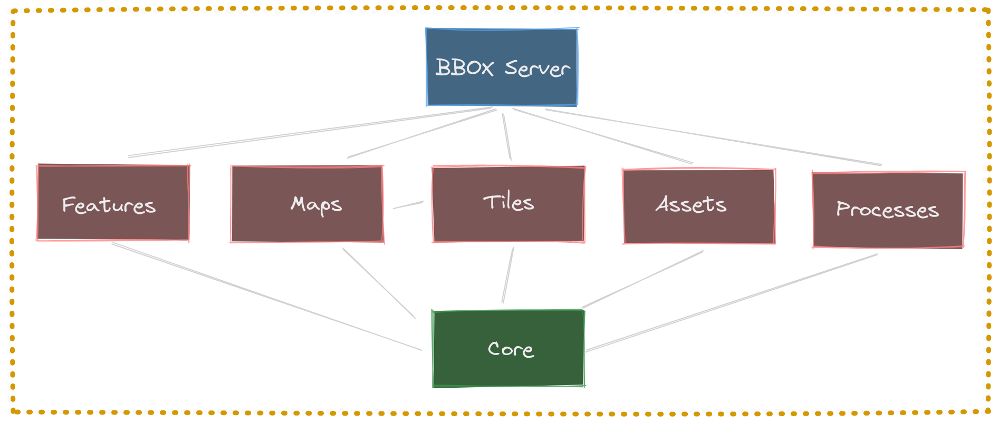

# BBOX Server

Composable spatial services.

## Components

* [BBOX Feature server](docs/feature-server/): OGC API Features service
* [BBOX Map server](docs/map-server/): OGC API Map service
* [BBOX Tile server](docs/tile-server/): OGC API Tile service
* [BBOX Asset server](docs/asset-server/): Serving static and templated files
* [BBOX Processes server](docs/processes-server/): OGC API Processes service
* [BBOX Routing server](docs/routing-server/): OGC API Routing service (experimental)

## Features

* Built-in high performance HTTP server
* OpenAPI support with built-in UI
* Instrumentation: Prometheus metrics and Jaeger tracing
* Healths endpoints for Docker and Kubernetes hosting
* Common configuration file
* Open Source under Apache-2.0 / MIT license

## Installation

* [BBOX Server](docs/installation/) (contains all components)
* [BBOX Tile Server](docs/tile-server/installation/)

## Links

* [Documentation](docs)
* [Changelog](https://github.com/bbox-services/bbox/blob/main/CHANGELOG.md)
